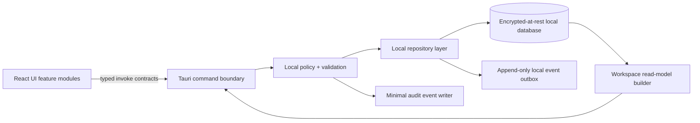

# Aura Windows Desktop V0 — Antigravity Engineering Work Package

**Audience:** Antigravity, Lead Software Engineer  
**Author:** Manus AI  
**Status:** Implementation-ready  
**Repository:** `sbenedeee-cpu/aura-desktop`  
**Target:** Windows-first Tauri 2 desktop client  
**Companion document:** [`AURA_V0_PRD_FOR_ANTIGRAVITY.md`](./AURA_V0_PRD_FOR_ANTIGRAVITY.md)

> **Mission:** Convert the current validated Aura architecture shell into a trustworthy, local-first project-continuity V0. Do not expand the product’s surveillance or automation surface in pursuit of feature quantity.

## 1. Engineering Mandate

Aura is a privacy-first, project-aware coordination layer. Its first useful release must make it easier to resume a project and preserve project decisions through **intentional capture, durable local records, reviewable memory, and a clear continuity brief**. The core engineering challenge is not displaying an AI interface. It is establishing a truthful local data foundation, explicit permission boundaries, provenance, and safe extensibility for later Windows perception and AI features.

The initial repository already proves the chosen platform and visual direction. It does **not** contain production persistence, native perception, local encryption, network sync, AI calls, OCR, UI Automation, or an installer. All work in this document must preserve that distinction in code, UX, tests, and claims made to the user.

## 2. Architecture Decisions That Are Locked

| Decision         | Required implementation stance                                                         | Do not do                                                                                                       |
| ---------------- | -------------------------------------------------------------------------------------- | --------------------------------------------------------------------------------------------------------------- |
| Desktop platform | Continue with **Tauri 2, React 19, TypeScript, and Rust**.                             | Do not re-platform to Electron, React Native Windows, or a web-only app without a new approved ADR and spike.   |
| Privacy          | V0 is manual/intentional capture only. Local processing and visible state are default. | Do not add passive screenshot, clipboard, microphone, browser, or accessibility capture.                        |
| Native access    | Extend the Rust command boundary through typed request/response contracts.             | Do not expose raw shell execution, arbitrary file paths, or unrestricted Tauri plugins.                         |
| Data model       | Build local durable records before sync or embeddings.                                 | Do not retain project state only in React state or invent cloud records before local lifecycle semantics exist. |
| AI               | Defer provider calls until local evidence, disclosure, and security gates exist.       | Do not put provider secrets in desktop code or add unscoped chat over all local data.                           |
| Product scope    | Prove project continuity for a solo Windows user.                                      | Do not build a multi-agent platform, general second brain, team product, or 3D Cortex.                          |
| UX               | Evidence-first, accessible, calm and local-state aware.                                | Do not imply that placeholder data, generated inferences, or paused capture are live intelligence.              |

These decisions are derived from the project’s approved research and architecture recommendation. Tauri’s capability model provides a useful least-privilege framework; it is not itself a complete security model.[1] Windows capture and UI Automation are later, consent-bound adapters rather than baseline data sources.[2] [3]

## 3. Repository Baseline and Current Truth

### 3.1 Existing source of truth

| Path                                    | Current responsibility                                                                         | Current limitation                                                                                          |
| --------------------------------------- | ---------------------------------------------------------------------------------------------- | ----------------------------------------------------------------------------------------------------------- |
| `src/App.tsx`                           | Single-page visual shell, view selection, local notices, sample project/signal rendering.      | Uses hard-coded `fallbackSnapshot`; it does not expose real routes, data, loading behavior, or persistence. |
| `src/App.css`                           | Aura visual language and responsive desktop shell styling.                                     | Needs modular styles/tokens and accessibility audit during feature implementation.                          |
| `src-tauri/src/lib.rs`                  | Three commands: workspace snapshot, privacy-mode change, intentional capture marker.           | All data is in memory; capture marker is a placeholder with no durable content or policy layer.             |
| `src-tauri/capabilities/default.json`   | Main-window capability definition.                                                             | Grants only `core:default`; this is the intentional V0 baseline.                                            |
| `src-tauri/tauri.conf.json`             | App identity `com.eternal.aura`, build commands, one desktop window, restrictive CSP baseline. | No updater, installer signing, or production packaging configuration yet.                                   |
| `docs/architecture.md`                  | Initial desktop/cloud trust-boundary description.                                              | Must be updated as data and native interfaces become real.                                                  |
| `docs/decisions/ADR-001-*`, `ADR-002-*` | Stack and intentional-capture decisions.                                                       | New security-sensitive features require new ADRs.                                                           |

### 3.2 Existing command surface

The current native boundary is intentionally tiny. Replace its implementation, but preserve the principle that UI code cannot directly access native resources.

| Tauri command                | Current behavior                         | Replacement target                                                                                           |
| ---------------------------- | ---------------------------------------- | ------------------------------------------------------------------------------------------------------------ |
| `get_workspace_snapshot`     | Returns hard-coded projects and signals. | Composes durable local project, task, decision, event, and privacy state into a read model.                  |
| `set_privacy_mode`           | Mutates an in-memory enum.               | Persists and validates a device privacy-state transition; appends audit event.                               |
| `record_intentional_capture` | Appends a dummy in-memory marker.        | Validates a typed user-approved capture request, writes event/artifact atomically, and returns a read model. |

## 4. Target V0 Local Architecture

The initial implementation is intentionally **local-only**. It must remain usable without a network connection, and it must not add external service credentials or background sync in the first release slices.



### 4.1 Required module boundaries

Create a feature-oriented frontend structure and a layered Rust domain architecture. Exact names can vary if the responsibilities remain explicit.

```text
src/
  app/
    AppShell.tsx
    routes.ts
    query-client.ts
  features/
    projects/
    capture/
    memory/
    activity/
    settings/
    today/
  components/
    ui/
    empty-state/
    provenance/
  lib/
    tauri-client.ts
    dates.ts
    validation.ts
  styles/
    tokens.css
    globals.css

src-tauri/src/
  lib.rs
  commands/
    projects.rs
    captures.rs
    claims.rs
    settings.rs
    activity.rs
  domain/
    project.rs
    event.rs
    capture.rs
    claim.rs
    settings.rs
    identifiers.rs
  application/
    project_service.rs
    capture_service.rs
    workspace_service.rs
  infrastructure/
    db/
      mod.rs
      migrations.rs
      repositories/
    crypto/
    clock.rs
  policy/
    capture_policy.rs
    retention_policy.rs
  read_models/
    workspace_snapshot.rs
  error.rs
```

**Boundary rule:** React components do not manufacture domain IDs, timestamps, retention behavior, ownership boundaries, or audit events. Rust application services own validation, domain transitions, persistence, and return typed DTOs. The browser/renderer never receives database keys, encryption material, or future provider credentials.

### 4.2 Local storage decision

Use a **local embedded SQLite database** in the Rust layer for V0 persistence. It is a practical fit for a single-device, offline-first structured application with migrations, atomic transactions, search, and a clear future outbox model. Use a maintained Rust database crate and a migration mechanism appropriate to the chosen crate. Select the exact crates through ADR-003, including license, update cadence, Windows compatibility, database encryption strategy, and backup/export implications.

Do not claim encryption at rest until the selected implementation provides it, has an explicit key-management path, and passes restart/recovery tests. Before that gate, label the release accurately as local persistence with a planned encryption layer.

### 4.3 Core domain contracts

The initial schema should be small and real. Do not create the entire cloud roadmap schema locally before the user workflow requires it.

| Entity            | Minimum fields                                                                                                                                                    | Notes                                                                                     |
| ----------------- | ----------------------------------------------------------------------------------------------------------------------------------------------------------------- | ----------------------------------------------------------------------------------------- |
| `Project`         | `id`, `name`, `goal`, `status`, `current_task`, `blocker`, `next_step`, `created_at`, `updated_at`, `archived_at`                                                 | Project is the default isolation boundary.                                                |
| `Task`            | `id`, `project_id`, `title`, `status`, `priority`, `notes`, `created_at`, `updated_at`, `completed_at`                                                            | Keep task hierarchy flat in V0.                                                           |
| `Event`           | `id`, `project_id`, `kind`, `actor`, `occurred_at`, `payload_version`, `payload_json`, `classification`, `retention`, `source_ref`                                | Append-only timeline/audit primitive.                                                     |
| `Artifact`        | `id`, `project_id`, `kind`, `title`, `body_or_uri`, `content_hash`, `classification`, `created_at`, `deleted_at`                                                  | Initial kinds: `note`, `text`, `url`. Avoid raw screenshot storage.                       |
| `Claim`           | `id`, `project_id`, `kind`, `statement`, `rationale`, `confidence`, `status`, `source_event_ids`, `supersedes_claim_id`, `created_at`, `updated_at`, `expired_at` | Use for decisions and reviewable memory.                                                  |
| `Capture`         | `id`, `project_id`, `kind`, `preview`, `source`, `capture_reason`, `retention`, `classification`, `status`, `artifact_id`, `event_id`                             | A capture is a deliberate action, not an observation stream.                              |
| `PrivacySettings` | `device_id`, `mode`, `retention_default`, `created_at`, `updated_at`                                                                                              | `mode` starts with `paused` and `manual_only`; do not invent active monitoring modes yet. |
| `ExclusionRule`   | `id`, `rule_type`, `value`, `enabled`, `created_at`                                                                                                               | Persist model/UI only; enforcement comes before a native adapter ships.                   |
| `ActivityEvent`   | `id`, `kind`, `occurred_at`, `severity`, `project_id`, `record_ref`, `metadata_json`                                                                              | Store minimal metadata; never default to raw artifact body.                               |

Use UUIDv7 or another sortable, opaque ID strategy consistently. All timestamps must be UTC ISO-8601 values generated in the Rust layer. Use strongly typed enums in Rust and a matching discriminated-union pattern in TypeScript. Add `schema_version`/`payload_version` fields wherever JSON extensibility is unavoidable.

## 5. Execution Plan

### Work Package 0 — Establish engineering guardrails

**Objective:** Make the repository safe for iterative feature development before new product behavior is added.

| Deliverable          | Required work                                                                                                           | Acceptance criteria                                                                          |
| -------------------- | ----------------------------------------------------------------------------------------------------------------------- | -------------------------------------------------------------------------------------------- |
| Repository standards | Add `CONTRIBUTING.md`, branch/commit conventions, security-sensitive change checklist, and local setup troubleshooting. | A new contributor can install, format, type-check, test, and build from README instructions. |
| Formatting/linting   | Add TypeScript formatting/linting and Rust `fmt`/Clippy commands; document all scripts.                                 | CI fails on formatting, TypeScript errors, and Clippy warnings chosen as deny-level.         |
| Test foundation      | Configure frontend unit testing and Rust unit/integration tests.                                                        | One meaningful frontend and one Rust test execute in CI.                                     |
| Dependency policy    | Lock package versions; add license/security scan appropriate to the project.                                            | PR checks produce actionable failure on known policy violation.                              |
| ADR-003              | Decide local database, migrations, and encryption/key-management plan.                                                  | ADR approved before database dependency is added.                                            |

**Non-goals:** no UI redesign; no native permission expansion; no provider SDK.

### Work Package 1 — Durable local repository and migrations

**Objective:** Replace all sample state with a persisted local domain model that survives restart and handles failure truthfully.

| Subtask            | Implementation requirements                                                                                                                                                  |
| ------------------ | ---------------------------------------------------------------------------------------------------------------------------------------------------------------------------- |
| Database bootstrap | Resolve platform-safe application data directory through Tauri/Rust APIs; create/open DB; run ordered, transactional migrations; surface a recoverable initialization error. |
| Repositories       | Implement repository interfaces for projects, tasks, artifacts, claims, captures, settings, and activity events. Use parameterized queries exclusively.                      |
| Transactions       | Capture save, claim correction, project archive, and privacy-mode transition each commit all associated domain/event writes atomically.                                      |
| Read model         | Build `WorkspaceSnapshot` from repository data, not sample objects. Permit empty state with no fabricated projects.                                                          |
| Seed behavior      | Remove product-facing sample projects. Development-only seed data, if needed, must require an explicit development command and never run in packaged apps.                   |
| Error model        | Define typed domain/application errors mapping to safe frontend codes and readable user messages. Do not pass raw database errors to UI.                                     |

**Required tests**

| Test                    | Pass condition                                                                    |
| ----------------------- | --------------------------------------------------------------------------------- |
| Migration fresh install | Empty database migrates to current version.                                       |
| Migration upgrade       | A fixture from each prior schema migrates without losing required records.        |
| Restart persistence     | Create project/task/capture, restart app/service, and verify state.               |
| Transaction failure     | Simulated failure during capture write commits no partial artifact/event/capture. |
| Project isolation       | Query/read model for one project cannot return another project’s records.         |
| Empty first run         | No sample user data appears; UI presents useful empty state.                      |

### Work Package 2 — Projects, Today, and real continuity brief

**Objective:** Make the primary project-resumption workflow real without adding capture complexity.

| Surface        | Required behavior                                                                                                          |
| -------------- | -------------------------------------------------------------------------------------------------------------------------- |
| Projects list  | Create, select, edit, archive, and filter projects. Provide keyboard reachable controls and explicit archive confirmation. |
| Project detail | Display/edit goal, current task, next step, blocker, decisions, recent activity, and artifacts.                            |
| Today          | Render active project, deterministic continuity brief, recent activity, and next deliberate step from local records.       |
| Timeline       | Group events chronologically and link each to the relevant project record.                                                 |
| Empty states   | First run, no project selected, and no records yet receive clear actions.                                                  |

The continuity brief is initially deterministic. It must not infer missing decisions, blockers, or goals. Use templates such as “No blocker recorded” rather than invented summaries.

**Acceptance test scenario:** Create a project named `Aura Desktop`, set its goal and next step, add a task and a decision, restart the application, return to Today, and verify those fields appear with correct timestamps and project scope.

### Work Package 3 — Manual Capture and Activity

**Objective:** Establish Aura’s explicit capture contract and user-readable audit trail.

The capture form begins with `Manual note`, `Pasted text`, and `URL`. Each input has a project selector, title/label, body or URL, classification selector, retention selector, edit/preview step, and explicit save/cancel controls. Do not implement global hotkey, clipboard listener, active-window capture, or accessibility extraction in this package.

| Capture behavior | Implementation condition                                                                                                                  |
| ---------------- | ----------------------------------------------------------------------------------------------------------------------------------------- |
| Pause            | `paused` disables save and confirms no data is collected or queued.                                                                       |
| Manual-only      | Allows only capture data supplied in the form.                                                                                            |
| Classification   | Start with `standard` and `sensitive`; treat `sensitive` as a user-provided label with stricter UX copy, not automatic detection.         |
| Retention        | Start with `until_deleted` and `review_in_30_days`; model must support expansion.                                                         |
| Activity         | Add `CAPTURE_CREATED`, `CAPTURE_CANCELLED` only if useful telemetry is local/explicit, `CAPTURE_DELETED`, and persistence failure events. |
| Delete           | Delete capture/artifact content deliberately; retain only the minimum metadata needed by documented audit policy.                         |

**Privacy invariants**

1. Pressing escape, closing the form, or navigating away before confirmation must not write a capture.
2. Paused mode must block capture in both frontend and Rust service layer.
3. No background native API may be invoked by this feature.
4. Capture content must not be included in debug logs, error telemetry, or UI notices.
5. Any later network addition must require a test that demonstrates no local-only record is sent without user-visible scope/approval.

### Work Package 4 — Claims, Decisions, Memory Review, and Search

**Objective:** Turn raw project records into durable, correctable memory rather than an opaque note pile.

| Feature            | Requirements                                                                                                                                                              |
| ------------------ | ------------------------------------------------------------------------------------------------------------------------------------------------------------------------- |
| Decision composer  | Creates a `Claim` with title/statement, rationale, project, sources, confidence, and status.                                                                              |
| Claim detail       | Displays provenance, linked events/artifacts, version lineage, status, expiry, and delete/correct actions.                                                                |
| Correction         | Uses a transactional “new version supersedes old version” operation. Old version stays inspectable but is not current.                                                    |
| Memory review      | Supports list filters: project, type, status, expired, sensitive. Generated insight candidates are intentionally absent until AI is introduced.                           |
| Local search       | Use parameterized local full-text/text search constrained to project and record type. Render match context plus source/provenance.                                        |
| Retrieval test set | Add fixtures representing several Aura projects, decision terminology, stale claims, and conflicting records. Create relevance assertions before semantic retrieval work. |

Do not add embedding storage or vector libraries in this package. First demonstrate that local structured and textual retrieval supports the continuity brief and a user can locate a recorded decision.

### Work Package 5 — Settings, Privacy State Machine, Local Export

**Objective:** Complete the user-control plane before adding broader observation or sync.

Define a Rust-owned privacy state machine:

```text
paused <-> manual_only
```

Future modes such as `authorized_metadata` and `filtered` must remain unavailable feature flags until the relevant native adapter and exclusions enforcement exist. The UI can show these as future/not enabled states, but cannot imply current access.

| Requirement        | Definition of done                                                                                                            |
| ------------------ | ----------------------------------------------------------------------------------------------------------------------------- |
| Persisted mode     | Restart retains the selected mode and UI/native state agree.                                                                  |
| Retention defaults | New manual captures inherit, display, and can override default retention.                                                     |
| Exclusion model    | User can add/edit/disable exclusion rules; the UI explains these apply when supported observation adapters are enabled later. |
| Local export       | User can export their own project records in a documented JSON/Markdown format to a selected path with preview/confirmation.  |
| Local delete       | User can delete a capture/claim/project data according to defined cascade rules and see final confirmation.                   |
| Activity           | Settings transitions and export/delete requests create minimal activity entries.                                              |

### Work Package 6 — Windows Native Perception Discovery Spike

**Objective:** Test feasibility, not build a user-facing monitoring feature.

This package begins only after Work Packages 0–5 pass. Create an isolated Rust adapter behind a feature flag, no broad production capability, and no default execution. The spike should test explicit invocation and immediately discard raw data after recording metrics.

| Experiment              | Required measurement                                                                        | Exit decision                                                        |
| ----------------------- | ------------------------------------------------------------------------------------------- | -------------------------------------------------------------------- |
| Active window metadata  | App/process/title accuracy, event latency, idle CPU, behavior for protected/remote windows. | Is event-driven metadata reliable enough for user-triggered capture? |
| UI Automation allowlist | Browser, Figma, VS Code, document app: availability, structure usefulness, errors.          | Which exact app classes qualify for a supported-context matrix?      |
| OCR feasibility         | Local/native options on curated images: accuracy, latency, device requirements, memory/CPU. | Is local OCR viable as a fallback and on what hardware?              |
| Exclusion enforcement   | Verify blocked app/domain/context returns no processed output.                              | Can an exclusion guarantee be stated for the supported adapter?      |

Do not ship this spike as a default app behavior. A new ADR and design review are required to transition any adapter to a controlled V0 feature.

### Work Package 7 — Backend, Sync, and AI Design Spikes

**Objective:** De-risk the cloud trust boundary without entangling it with the local release.

The approved future target is Supabase Auth/Postgres/Storage/Realtime plus a small server-side policy/orchestration boundary. RLS must protect exposed tables; service credentials never belong in the desktop client.[4]

| Spike                 | Deliverable                                                                        | Non-negotiable security condition                                           |
| --------------------- | ---------------------------------------------------------------------------------- | --------------------------------------------------------------------------- |
| Event contract/outbox | Versioned event envelope, idempotency key, cursor/retry design, conflict examples. | Desktop retains unsent data locally; replay cannot duplicate mutations.     |
| Supabase schema/RLS   | Draft migration set and policy test matrix for user/project rows.                  | RLS tests cover every exposed table; client cannot use service role.        |
| Context packet        | Typed `CurrentContext` schema and token-budget builder using seeded records.       | Sources, project scope, classification, and uncertainty remain visible.     |
| Provider adapter      | Internal mockable interface with structured output schema.                         | No API key in renderer; untrusted artifact text never becomes instructions. |
| Prompt-injection test | Malicious note/URL/OCR fixtures with expected safe behavior.                       | Model/tool plan cannot override policy or expand data/tool scope.           |

## 6. Native and AI Security Requirements

### 6.1 Trust zones

| Zone               | Examples                                                                             | Handling rule                                                       |
| ------------------ | ------------------------------------------------------------------------------------ | ------------------------------------------------------------------- |
| Trusted system     | Rust validation logic, signed app configuration, policy code.                        | Never supplied by captures or model output.                         |
| Trusted user       | Explicit typed form input, approved settings transitions, consent confirmation.      | Validate and preserve origin.                                       |
| Untrusted external | Notes, URLs, document text, UI Automation values, OCR text, future web/tool results. | Store/retrieve as data; never treat as instructions or permissions. |

### 6.2 Non-negotiable controls

- Every new Tauri permission, plugin, native command, or filesystem/network scope needs an ADR, capability review, and test.
- Use schema-validated request/response DTOs at every Tauri command. Reject unknown fields where practical.
- Do not serialize secrets, database keys, raw provider responses, or capture bodies into application logs.
- Treat frontend values, local database content, imported text, model output, and tool output as untrusted until Rust/server validation assigns a narrow type.
- Future tool calls must use structured arguments, policy validation, scope checks, durable approval ID, and human-readable audit output. The model may recommend but never self-authorize.[5]
- Do not add an unrestricted filesystem, shell, HTTP, browser automation, or plugin permission “for future use.”

## 7. Quality, Test, and CI Matrix

| Layer               | Minimum checks                                                                                   | Trigger                                      |
| ------------------- | ------------------------------------------------------------------------------------------------ | -------------------------------------------- |
| Frontend            | Type check, lint, formatting, component/unit tests, accessibility smoke tests.                   | Every PR and release build.                  |
| Rust domain         | Format, Clippy, unit tests for state transitions and policies.                                   | Every PR.                                    |
| Rust infrastructure | Temp-database repository tests, migration tests, transaction failure tests.                      | Every PR touching persistence.               |
| Desktop IPC         | Command contract tests for success/error DTOs and paused-capture block.                          | Every PR touching commands.                  |
| End-to-end desktop  | Core project → capture → restart → resume flow.                                                  | Main branch and release candidate.           |
| Security            | Dependency/secret scan; capability manifest diff review; no outbound request in local-only test. | Every PR; manual review for sensitive files. |
| Future AI           | Injection fixtures, schema validation, policy-gateway tests, context scope tests.                | Required before provider feature merge.      |

Define performance budgets before feature code makes performance claims. Initial suggestions: a local project open should target under 200 ms p50 on a representative Windows device; manual capture save should provide feedback inside 100 ms and complete durable storage quickly enough to feel synchronous; any heavier operation requires visible progress/cancel behavior. Treat these as initial hypotheses to measure, not release claims.

## 8. Branching, Commit, and Review Protocol

| Rule                      | Requirement                                                                                                                                                   |
| ------------------------- | ------------------------------------------------------------------------------------------------------------------------------------------------------------- |
| Branch scope              | One coherent work package or small subtask per branch; no unrelated cleanup.                                                                                  |
| Commit format             | Conventional commits: `feat:`, `fix:`, `docs:`, `test:`, `refactor:`, `chore:`.                                                                               |
| Pull request              | State PRD requirement IDs, affected ADRs, migration impact, tests run, screenshots for UI, and explicit non-goals.                                            |
| Security-sensitive review | Required for `src-tauri/capabilities/**`, Rust native adapters, data migrations, retention, export/delete, provider calls, prompts, sync, and authentication. |
| Dependencies              | Any production dependency needs justification, license check, maintenance check, and removal of unused alternatives.                                          |
| Migrations                | Forward-only, tested against fixture data, idempotent when appropriate, documented rollback/recovery plan.                                                    |
| Feature flags             | Use for native perception and provider-backed features; default to disabled until release gate passes.                                                        |

## 9. First Sprint Task Board

Antigravity should begin with the smallest vertical slice that makes the existing shell truthful. Do not start native perception or AI work in parallel.

| Priority | Ticket                                           | Dependency | Definition of done                                                                  |
| -------: | ------------------------------------------------ | ---------- | ----------------------------------------------------------------------------------- |
|       P0 | ENG-001: Engineering scripts and CI              | None       | Format, lint, type-check, Rust check/test, frontend test execute locally and in CI. |
|       P0 | ADR-003: Local persistence decision              | ENG-001    | Chosen database/migration/encryption plan is documented and approved.               |
|       P0 | ENG-002: Rust domain primitives and error model  | ADR-003    | IDs, UTC clock, enums, DTOs, error codes, and unit tests exist.                     |
|       P0 | ENG-003: Local database bootstrap and migrations | ENG-002    | Fresh install, upgrade fixture, and error behavior tests pass.                      |
|       P0 | ENG-004: Project and event repositories          | ENG-003    | CRUD/archive/timeline behavior passes repository tests.                             |
|       P0 | ENG-005: Replace snapshot sample data            | ENG-004    | App shows actual empty state and persisted project read model after restart.        |
|       P1 | UX-001: Projects and Today vertical slice        | ENG-005    | Create/edit/select project and deterministic brief work end-to-end.                 |
|       P1 | CAP-001: Manual capture form and policy          | ENG-004    | Explicit capture save/cancel/pause behavior passes unit and E2E tests.              |
|       P1 | CAP-002: Activity feed                           | CAP-001    | Capture, edit, failure, and archive events render with safe metadata.               |
|       P1 | MEM-001: Decision claim lifecycle                | ENG-004    | Confirm/correct/supersede behavior with provenance passes transaction tests.        |
|       P1 | SET-001: Persisted privacy settings              | ENG-003    | UI and Rust service agree on state after restart.                                   |

## 10. Definition of Done for Every Feature

A feature is not done because its UI appears. It is done only when all applicable conditions are met.

| Category         | Done condition                                                                                                  |
| ---------------- | --------------------------------------------------------------------------------------------------------------- |
| Product          | PRD requirement IDs and acceptance criteria are met; empty/error/offline states exist.                          |
| Data             | Ownership, project scope, timestamps, provenance, classification, retention, and migration impact are explicit. |
| Security/privacy | Permission impact reviewed; no hidden collection/transmission; user controls and rollback behavior clear.       |
| Engineering      | Typed contracts, tests, lint/type checks, error handling, and accessible UI implemented.                        |
| Observability    | Minimal safe activity/error metadata exists without logging sensitive content.                                  |
| Documentation    | README/ADR/architecture notes updated if contract, dependency, data, permission, or workflow changed.           |
| Verification     | PR includes commands run, relevant test output, and a concise manual test script.                               |

## 11. Handoff Prompt for Antigravity

```text
You are taking over engineering for Aura Desktop, a Windows-first Tauri 2 application.

Read these documents in order:
1. docs/AURA_V0_PRD_FOR_ANTIGRAVITY.md
2. docs/AURA_ANTIGRAVITY_ENGINEERING_WORK_PACKAGE.md
3. docs/architecture.md
4. docs/decisions/ADR-001-tauri-react-rust.md
5. docs/decisions/ADR-002-intentional-capture.md

Start only with P0 work from the First Sprint Task Board. The current UI and Rust commands are an architecture shell with hard-coded/in-memory data. Your first outcome is durable, local-only project continuity: persistent projects, events, Today brief, manual capture, privacy-state persistence, and a readable activity trail.

Do not add continuous monitoring, screenshots, OCR, UI Automation, clipboard listeners, provider SDKs, remote sync, external tools, or unrestricted Tauri permissions. Each of those requires an approved ADR, a narrow prototype, consent UX, security tests, and a release gate.

Work in small branches. Before coding, state the ticket, PRD requirement IDs, affected interfaces, migration impact, test plan, privacy impact, and non-goals. After coding, run the quality checks and report what is implemented, what remains, and any decision needing escalation.
```

## 12. References

[1]: https://v2.tauri.app/security/capabilities/
[2]: https://learn.microsoft.com/en-us/windows/apps/develop/media-authoring-processing/screen-capture
[3]: https://learn.microsoft.com/en-us/windows/win32/winauto/entry-uiauto-win32
[4]: https://supabase.com/docs/guides/database/postgres/row-level-security
[5]: https://developers.openai.com/api/docs/guides/agent-builder-safety
